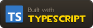
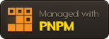
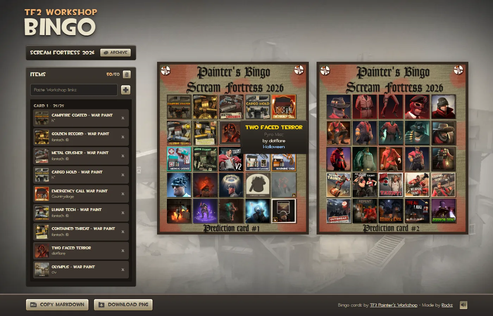

# TF2 Workshop Bingo

<a href="https://www.typescriptlang.org"></a>
<a href="https://vite.dev"></a>
<a href="https://pnpm.io"></a>

Fill a Painter's Bingo prediction card with Steam Workshop items, styled like TF2's own menus and backpack. Paste links, arrange them, then export a full-size PNG or a Markdown list.



## Running it

```sh
pnpm install
pnpm dev       # http://127.0.0.1:5173
pnpm check     # link parsing, Markdown and tag checks
pnpm build     # type-check and build to dist/
pnpm preview   # serve the build
```

Inside a pnpm workspace, add `--ignore-workspace` to each command.

## Using it

- **Add items:** paste Workshop links anywhere (Ctrl+V), type them into the field and press Enter, or drag a link from a Steam tab onto a square. Several links at once work.
- **Choose where they go:** click an empty square first; new items fill from there.
- **Rearrange:** drag a square or a list row onto another to swap them, or click two squares. Dragging follows the TF2 backpack (`CBackpackPanel` in the Source SDK): press and move 10px or hold 0.3s, the item follows the cursor, and dropping anywhere else puts it back.
- **Inspect:** hover a square for a TF2-style item tooltip (name, type, creator, tags).
- **Remove:** right-click a square, press Delete on it, or use the × in the list. Clearing a card can be undone.
- **Copy Markdown:** `- [Title](workshop link) by [Creator](profile)`, in card order. If the clipboard is blocked, a `.md` file is saved instead.
- **Download PNG:** the poster at full size with the thumbnails drawn in.
- **Archive:** every card, grouped by event. Each card keeps its own items in the browser (`localStorage`).

## Project layout

```
src/
  main.ts          app state, rendering, drag and drop, event wiring
  style.css
  data/
    cards.ts       card registry: posters and slot rectangles
    storage.ts     localStorage: items per card
  steam/
    api.ts         Steam requests (item details and uploader names, via worker/)
    workshop.ts    link parsing, Markdown export, tag descriptions (pure, covered by `pnpm check`)
  ui/
    dom.ts         element lookup helper
    export.ts      full-size PNG rendering
    sound.ts       TF2 UI sounds and mute
    tooltip.ts     TF2-style item tooltip
worker/            Cloudflare Worker: Steam proxy holding the Steam Web API key
scripts/
  check-workshop-links.mjs   `pnpm check`
  make-badges.py             regenerates docs/badges/ (TF2 tooltip-style README badges)
public/
  templates/       posters, one folder per event (PNG only; see below)
  ui/              TF2 fonts, textures, icons and sounds
```

## Adding cards

Cards live in `src/data/cards.ts`, newest event first. The newest event gets quick buttons; every event is listed in the archive. To add one (say an older Scream Fortress card):

1. Put the full-size PNG in `public/templates/<event>/` (e.g. `scream-fortress-2025/card-1.png`). Only the PNG is committed: the page shows a 2048px `.webp` of the same name, which `vite.config.ts` generates with `sharp` (on request in dev, as files in `pnpm build`).
2. Add an entry using `poster("<event>", "<name>")` and the slot rectangles in the PNG's pixel coordinates. `grid()` builds a regular grid; any slot count works.

## Deploying

Every push to `main` builds the site and publishes it to GitHub Pages (`.github/workflows/ci.yml`). The build uses relative URLs, so it works from any path.

The app gets item details through a small Cloudflare Worker in `worker/`, because the Workshop API doesn't allow cross-origin requests and uploader names need a Steam Web API key that must stay server-side. It has one route, `POST /workshop`: it forwards to `ISteamRemoteStorage/GetPublishedFileDetails` and adds a `names` map from one batched `ISteamUser/GetPlayerSummaries` call (edge-cached for a day). Thumbnails load straight from Steam's image CDN, which allows any origin.

To stop it being used as a free Steam proxy, the worker only answers the site's origins (`https://rhgx.github.io` and local dev), accepts at most 100 numeric item IDs in a small body, and rate-limits each IP to about 20 requests a minute. On the free plan, running out of quota only stops the worker for the day; it never bills.

Dev, `pnpm preview` and the Pages build all use the deployed worker. To run your own (the free tier is plenty):

```sh
cd worker
pnpm dlx wrangler login
pnpm dlx wrangler secret put STEAM_API_KEY    # from https://steamcommunity.com/dev/apikey
pnpm dlx wrangler deploy                      # prints https://tf2-workshop-bingo.<you>.workers.dev
```

Add your site's origin to `allowedOrigin` in `worker/index.ts` first, then build with `VITE_STEAM_PROXY` set to that URL. Without the key, items still load, just without uploader names.

## Known limitations

- **One creator per item.** The Steam API only reports the uploader, even with a key. Co-creators only appear on each item's Workshop page, so showing them means scraping those pages in the worker; the shelved scraper and the reasoning are in `src/steam/api.ts`.
- **Saved data is per browser.** Nothing is uploaded or synced.

## Credits

Unofficial fan tool, not affiliated with Valve. Team Fortress 2 fonts, textures, icons and sounds are Valve's, extracted from the game files (`tf2_misc_dir.vpk`, `tf2_textures_dir.vpk`, `tf2_sound_misc_dir.vpk`). The Painter's Bingo cards are made by [TF2 Painter's Workshop](https://steamcommunity.com/groups/PaintersWorkshop). Workshop items and thumbnails belong to their creators. The README badges follow [Devin's Badges](https://github.com/intergrav/devins-badges); they come from [Simple Icons](https://simpleicons.org). The Markdown button icon is the [Markdown mark](https://github.com/dcurtis/markdown-mark) redrawn as a page in the style of the game glyphs.
